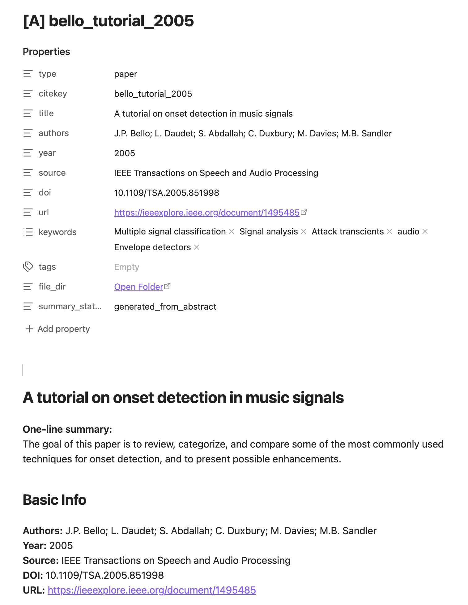
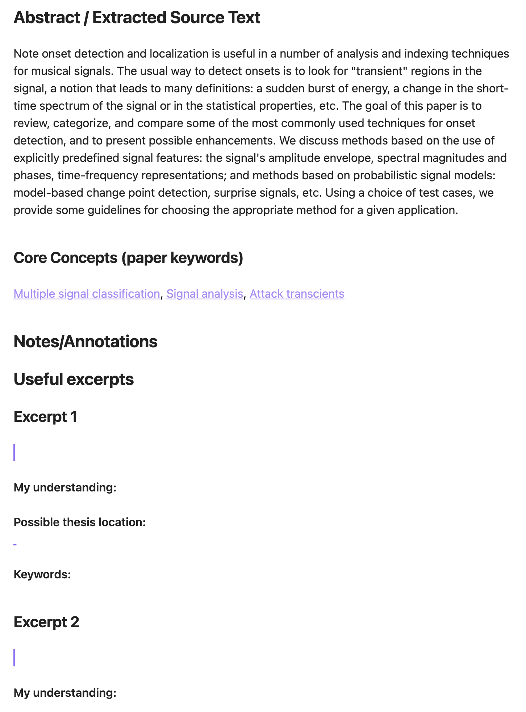
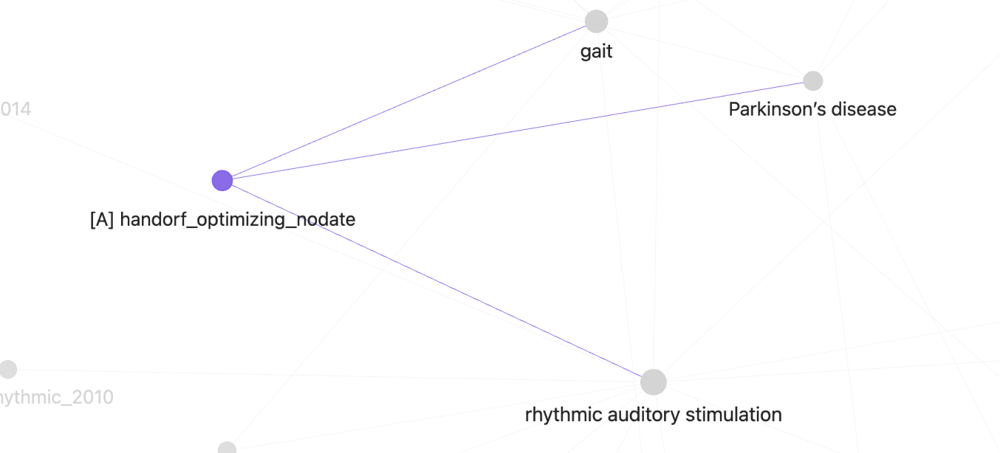
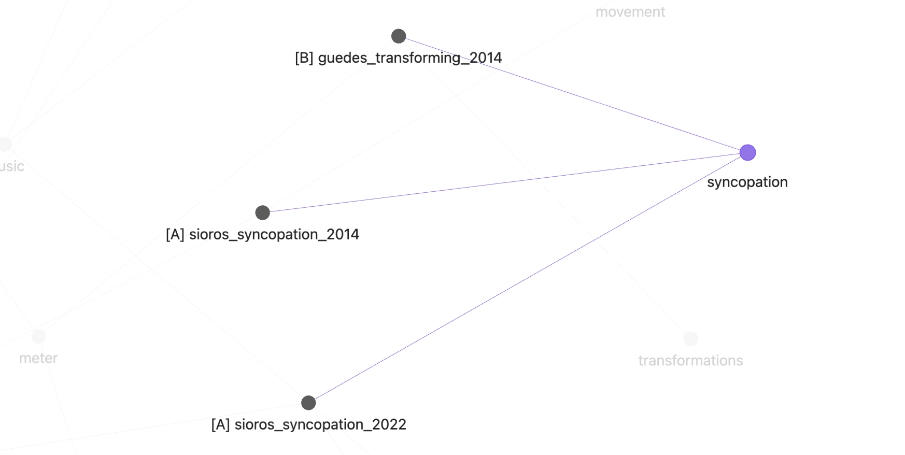

# bib to Obsidian Notes for Academic

Generate Obsidian-friendly Markdown paper notes from a Zotero Better BibLaTeX `.bib` export.

This script is designed for large literature collections where each BibLaTeX entry should become one note with:

- core metadata
- a one-line summary
- abstract or PDF-derived source text
- lightweight concept links for Obsidian navigation
- CSV reports for audit and troubleshooting

## Features

- Parses Better BibLaTeX `.bib` exports without requiring a BibTeX parser dependency
- Uses the BibLaTeX citekey as the Markdown filename
- Prefers the exported abstract when available
- Falls back to PDF text extraction when no abstract is present
- Tries to detect abstract-like text from the first pages of the PDF
- Extracts paper keywords from:
  - BibLaTeX `keywords` fields
  - PDF keyword blocks such as `Keywords`, `Key words`, and `Index Terms`
- Keeps note metadata and report files separate
- Produces reproducible CSV reports for batch review

## Current Note Design

Each generated note contains two keyword layers:

- `keywords` in YAML:
  Keeps up to the first 5 extracted keywords for metadata retention.

- `Core Concepts` in the note body:
  Shows only the first 3 keywords as Obsidian links to reduce noise in large collections.

This design aims to balance:

- richer metadata preservation
- cleaner concept linking
- lower graph clutter in large vaults

## Files

- `generate_obsidian_notes.py`: main script
- `requirements.txt`: Python dependencies for local use outside the bundled Codex runtime

## Recommended Python Environment

Use a virtual environment so PDF parsing dependencies do not affect your global Python installation.

```bash
python3 -m venv .venv
source .venv/bin/activate
python -m pip install --upgrade pip
python -m pip install -r requirements.txt
```

## Dependencies

- `pypdf`
- `pdfplumber`

The script prefers `pypdf` for PDF text extraction and falls back to `pdfplumber` when needed.

If neither library is installed, entries without abstracts can still be turned into notes, but PDF-based extraction will fail.

## Usage

Basic usage:

```bash
python generate_obsidian_notes.py \
  --bib papers.bib \
  --output ./PaperNotes_papers
```

If your exported attachment paths are relative, also pass the Zotero storage root:

```bash
python generate_obsidian_notes.py \
  --bib input.bib \
  --output ./PaperNotes \
  --zotero-storage "/Users/USERNAME/Zotero/storage"
```

To overwrite existing notes:

```bash
python generate_obsidian_notes.py \
  --bib input.bib \
  --output ./PaperNotes \
  --overwrite
```

## Command-Line Arguments

- `--bib`: input Better BibLaTeX `.bib` file
- `--output`: output directory for generated Markdown notes
- `--zotero-storage`: optional Zotero storage root for resolving relative attachment paths
- `--overwrite`: overwrite existing Markdown notes
- `--pdf-pages`: number of leading PDF pages to inspect when no abstract is present
- `--errors-log`: optional custom path for the plain-text error log; by default it is written to the report directory

## Output Structure

The script creates:

- one Markdown note per BibLaTeX entry, named `{citekey}.md`, inside the directory passed to `--output`
- a separate report folder alongside the note folder, named `{output_dir}_reports`
  - `processing_report.csv` inside the report directory
  - `skipped_entries.csv` inside the report directory
  - `errors.log` inside the report directory, unless `--errors-log` is provided

Example:

- `--output ./PaperNotes_papers`
- notes directory: `./PaperNotes_papers`
- report directory: `./PaperNotes_papers_reports`

## Note Previews
**Standard note structure**




> `summary_status` can currently be:
> 
> - `generated_from_abstract`
> - `generated_from_pdf`
> - `needs_manual_review`

**Graph View**

For each paper, up to three core concepts are linked for navigation:


one keyword may appear in many papers:



## Reports

`processing_report.csv` includes:

- `citekey`
- `title`
- `has_abstract`
- `has_pdf`
- `pdf_path`
- `summary_status`
- `note_created`
- `error_message`

`skipped_entries.csv` contains entries that could not be parsed at the BibLaTeX-entry level.

`errors.log` contains extraction or write-time issues that did not prevent note generation.

## Keyword Extraction Strategy

Keyword extraction is intentionally conservative.

Priority order:

1. Use BibLaTeX `keywords` when present
2. Otherwise inspect PDF text
3. Prefer explicit keyword headers such as:
   - `Keywords`
   - `Key words`
   - `Index Terms`

The PDF keyword logic currently supports:

- inline keyword lists
- keyword labels followed by a comma-delimited next line
- keyword labels followed by a vertical one-item-per-line list

Safeguards:

- at most 5 metadata keywords are stored
- `Core Concepts` only uses the first 3
- extraction stops at obvious section boundaries such as `Abstract`, `Introduction`, `Methods`, and similar headers
- the parser prefers under-extraction over swallowing nearby body text

## Limitations

- PDF layout remains the hardest part of the pipeline
- two-column articles may still produce imperfect text order
- some PDF keyword blocks are difficult to recover when layout extraction interleaves body text
- keyword extraction is conservative by design, so some valid keywords may be missed
- author-provided keyword ordering is not guaranteed to reflect importance, though earlier keywords are often more useful in practice

## Project Positioning

This project is intended to be:

- useful for personal and research-group literature workflows
- local-first by default
- auditable through CSV reports
- extensible through better rule-based extraction over time
